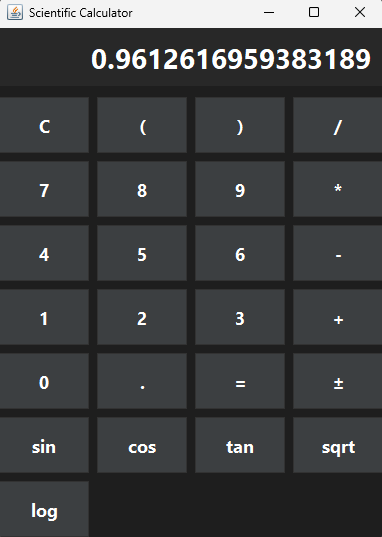

# Scientific Calculator in Java

A modern scientific calculator built in Java with **stack-based expression evaluation** and a **dark-themed UI**. Supports:

- Basic operations: `+ - * /`
- Parentheses `( )`
- Functions: `sin(x)`, `cos(x)`, `tan(x)`, `sqrt(x)`, `log(x)`
- Decimal numbers and negative numbers
- Modern, professional UI suitable for portfolio

---

## Screenshots




---

## How to Run

1. Clone the repository:

```bash
git clone https://github.com/<your-username>/ScientificCalculator-Java.git
